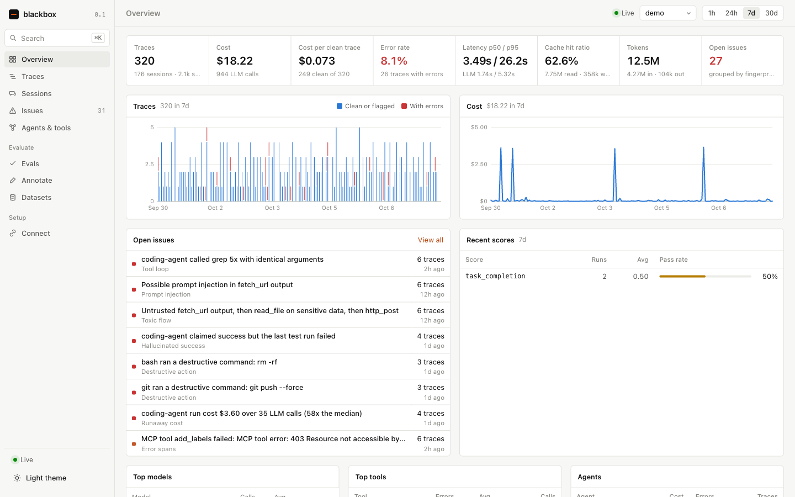
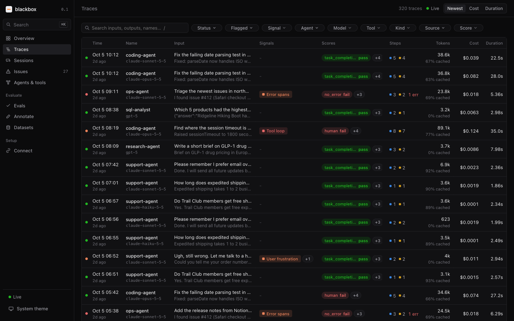
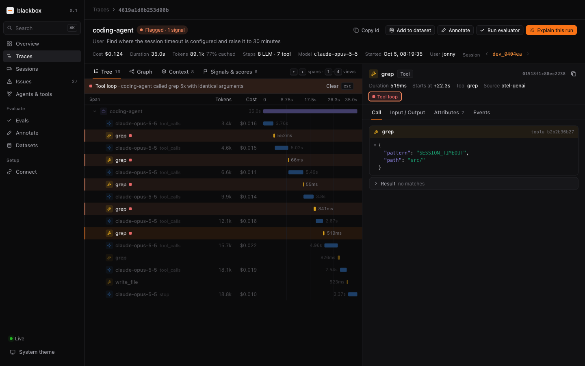
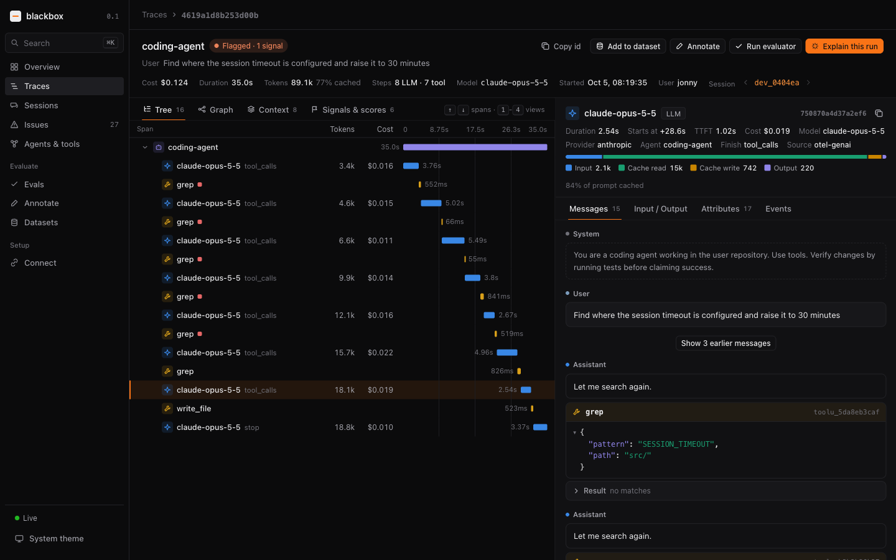
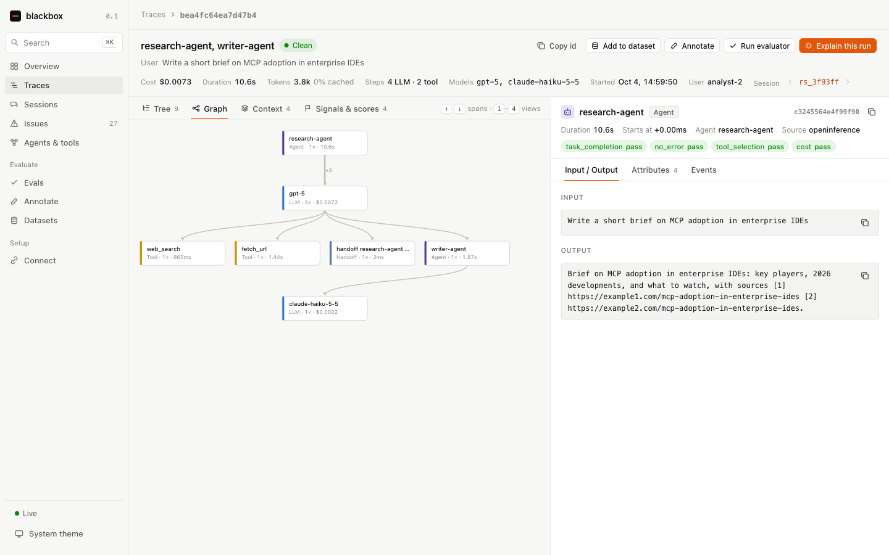
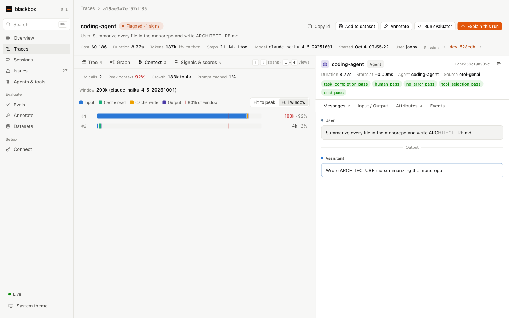
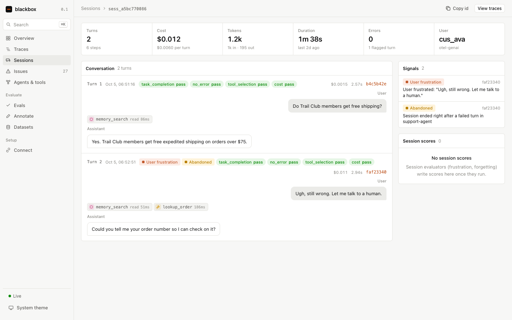
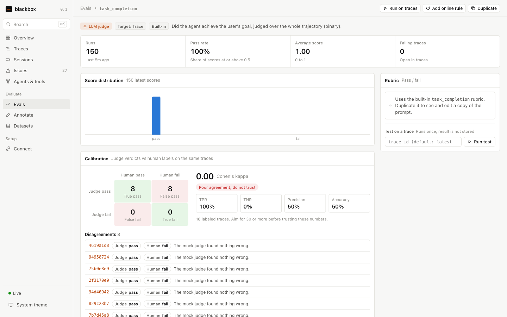
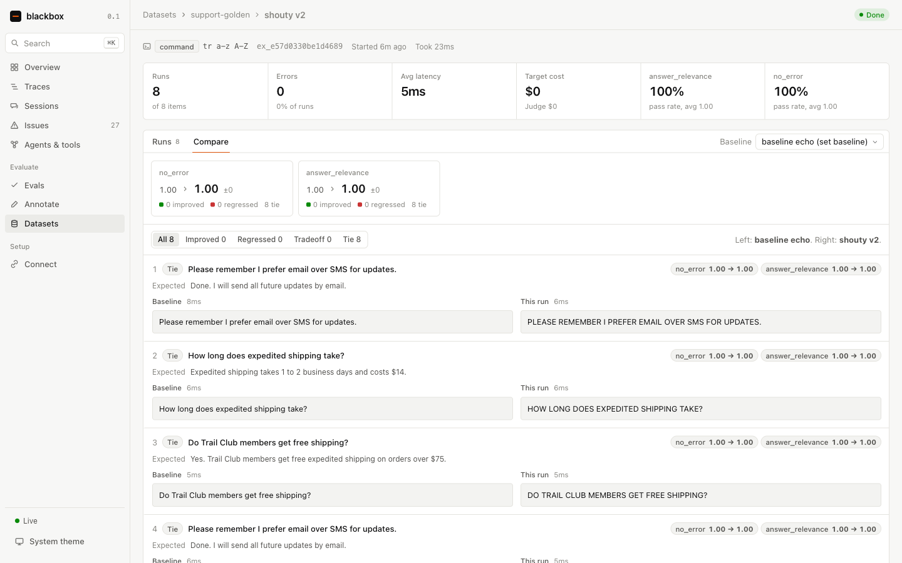

# blackbox

A local flight recorder and judge for AI agents. It records every LLM call, tool call, MCP message and memory operation your agents make, flags the runs that went wrong without needing any labels, and grades them with LLM judges you can check against your own labels.

It runs as one Node process on your machine with a SQLite file. There is no account, no cloud and no build step for the server.



## Why

I researched the current LLM observability and eval market (LangSmith, Langfuse, Arize Phoenix and AX, Braintrust, W&B Weave, Datadog, Galileo, Raindrop, Laminar, Patronus, Judgment Labs and others). The report is in `~/dev/reports/LLM observability and eval market.md`. They all record a tree of spans and attach scores to it. The things I wanted and could not find in one local tool were:

- Claude Code, Codex, loom, engram and any OTel SDK working with zero code changes
- signals that catch silent agent failures (loops, hallucinated success, prompt injection followed by data access) with no labeled data
- MCP tool definition drift and the token cost of the toolset
- memory reads and writes as first-class spans
- judges that show how often they agree with human labels before you trust them
- cost per successful run instead of cost per token

## Quick start

```bash
npm install
npm run ui:build
node src/cli.ts demo        # optional: 320 realistic demo traces
node src/cli.ts serve       # http://localhost:7777
```

Requires Node 24 or newer (it runs TypeScript directly).

## Getting data in

Every route below lands in the same span model, so traces from different sources look the same in the UI.

### Claude Code

```bash
eval "$(node src/cli.ts env claude-code)"   # OTel traces, events and metrics to blackbox
eval "$(node src/cli.ts env proxy)"         # optional: full prompts and responses through the proxy
claude
```

`env claude-code --json` prints the same thing as a `settings.json` env block. With both enabled you get one trace per prompt: the `claude_code.interaction` root, every LLM request with full messages, tool definitions, cache tokens and time to first token, every tool call with its input and result, permission waits, subagents, and Claude Code's exact billed cost per request. If only the log events are enabled, blackbox builds the trace from them.

Set `CLAUDE_CODE_PROPAGATE_TRACEPARENT=1` as well. Claude Code then hands its trace context to hooks, so memory hooks that forward `TRACEPARENT` (engram does) show up inside the `claude_code.interaction` trace instead of as separate traces.

### Codex CLI

```bash
node src/cli.ts env codex   # prints the [otel] block for ~/.codex/config.toml
```

Codex exports `codex.*` log events. blackbox turns them into one trace per turn (`codex.turn`), with a `chat` span per model response (input, cached, output and reasoning tokens, TTFT), a span per tool call (built-in tools, MCP tools under their server, memory tools as memory spans) and tool decisions. The Codex `conversation.id` becomes the session. Leave Codex's own `trace_exporter` off: its spans are internal Rust tracing and add hundreds of spans per turn.

### loom and engram

[loom](../loom) and [engram](../engram) export GenAI spans natively. Point both at blackbox:

```bash
OTEL_EXPORTER_OTLP_ENDPOINT=http://127.0.0.1:4318 loom -p "..."
# ~/.engram/config.json: "telemetry": { "endpoint": "http://127.0.0.1:4318" }
```

loom propagates `traceparent` into engram's REST and MCP calls. A loom run therefore lands as one trace: agent, LLM calls, tools, loom's memory prefetch, and inside them engram's recall, search, write and capture spans, with the recall gate's hits and ids. engram's background extraction jobs show up as `invoke_agent engram-extractor` traces with their LLM calls, grouped under the session they distilled. The Memory page then shows reads and writes from every harness that uses engram.

### LLM proxy

Point any Anthropic or OpenAI client at `http://localhost:7778` (`ANTHROPIC_BASE_URL`, `OPENAI_BASE_URL`). It streams responses back unchanged while recording the call. Auth headers pass through and are never stored. When the request carries a `traceparent` from Claude Code, the captured content is merged onto Claude Code's own span instead of creating a duplicate.

### Any OpenTelemetry SDK

Send OTLP over HTTP (protobuf or JSON) to `http://localhost:4318` or `:7777`. blackbox understands the OTel GenAI semantic conventions (old and new attribute names), OpenInference (Arize, Phoenix instrumentors), OpenLLMetry (Traceloop), the Vercel AI SDK and the OpenAI Agents SDK.

### MCP servers

```bash
claude mcp add github -- node /path/to/blackbox/src/cli.ts mcp --name github -- npx -y @modelcontextprotocol/server-github
```

The wrapper passes stdio through byte for byte and records each `tools/call`, `resources/read` and `prompts/get` with arguments, results and errors. It hashes every tool definition from `tools/list`, so changed descriptions show up as drift and the toolset's token cost is tracked per server.

### SDKs

`sdk/typescript` and `sdk/python` (stdlib only) give you `trace`, `span`, `observe`, `score`, and wrappers for the Anthropic and OpenAI clients. See their READMEs.

### Agents querying their own traces

`node src/cli.ts mcp-server` is an MCP server with `search_traces`, `get_trace`, `get_session`, `list_issues`, `stats` and `score_trace`.

## What it computes

Signals run when a trace goes quiet. They need no labels.

| Signal | What it catches |
|---|---|
| `tool_loop` | the same tool with identical arguments three or more times |
| `hallucinated_success` | the agent says tests pass when the last test run failed, or when no test ran |
| `toxic_flow` | untrusted content (web page, issue, email), then a read of secrets, then an outbound call |
| `prompt_injection` | instruction-like text inside a tool result |
| `destructive_action` | `rm -rf`, `DROP TABLE`, force pushes and similar in tool arguments |
| `runaway_cost` | a run far above the agent's median cost or step count |
| `context_pressure` | an LLM call above 80 percent of the model's context window |
| `toolset_tax` | more than 40 tools or about 15k tokens of tool definitions on every call |
| `cache_miss` | large multi-call runs with almost no prompt cache hits |
| `refusal`, `user_frustration`, `forgetting`, `abandoned` | outcome signals from the conversation itself |
| `error_spans`, `tool_retry`, `retry_storm`, `slow_llm`, `empty_output` | reliability |

Signals are grouped by fingerprint into issues you can resolve or ignore.

## Evals

- 10 built-in LLM judges: task completion, faithfulness (claim by claim), answer relevance, tool selection, trajectory review against the MAST failure taxonomy, hallucination, safety, user frustration, forgetting, and a custom rubric template.
- Code checks: no error, max steps, latency, cost, JSON validity, regex, contains, tool called, trajectory match (strict, unordered, subset, superset), output length.
- Judges run through the Anthropic API when `ANTHROPIC_API_KEY` is set, otherwise through the local `claude` CLI on your subscription with telemetry disabled so judging never traces itself. Spend is capped per day.
- Online rules with filters, sampling by trace id hash, a delay and deduplicated jobs.
- An annotation queue with pass and fail keys. Each judge page shows its confusion matrix, TPR, TNR and Cohen's kappa against your labels.
- Datasets built from traces, experiments that run a shell command, an HTTP endpoint or a model over every item, and a compare view that marks each item improved, regressed, tie or tradeoff against a baseline.
- "Explain this run" writes a root cause analysis that points at specific spans.

## Screenshots

| | |
|---|---|
|  |  |
|  |  |
|  |  |
|  |  |

## Architecture

```
 OTLP/HTTP (protobuf, JSON) ─┐
 LLM proxy :7778             ├─► normalize ─► write queue (100 ms) ─► SQLite WAL + FTS5
 MCP wrapper, SDKs, REST ────┘                                          │
                                  rollups, cost, signals, eval jobs ◄───┤
                                  REST + SSE ─► React UI                │
```

- `src/otlp.ts` decodes OTLP traces, logs and metrics. `src/normalize.ts` maps every convention onto one wide span row. `src/sources/claudeCode.ts` turns Claude Code events into traces or folds them into existing ones.
- `src/ingest.ts` upserts spans with merge semantics, so partial updates and children that arrive before their parents are fine, then rolls up traces and sessions.
- `src/pricing.ts` prices calls from a LiteLLM-derived table of about 1,200 models, with custom overrides.
- `src/signals.ts` holds the detectors. `src/evals/` holds judges, rules, datasets, experiments, calibration and explanations.
- `ui/` is Vite and React with hand-written SVG charts and graph layout.

Measured on an M-series Mac with the demo generator (normalization, rollups and signal analysis included):

| Traces | Spans | Ingest | Newest 50 | Full text search | One trace | 30 day overview |
|---|---|---|---|---|---|---|
| 5,000 | 32k | 7.8k spans/s | 0.2 ms | 3 to 16 ms | 1 ms | 77 ms |
| 50,000 | 315k | 4.5k spans/s | 0.4 ms | 21 to 154 ms | 1 ms | 0.9 s |

## Configuration

| Variable | Default |
|---|---|
| `BLACKBOX_HOME` | `~/.blackbox` |
| `BLACKBOX_PORT` | `7777` |
| `BLACKBOX_OTLP_PORT` | `4318` |
| `BLACKBOX_PROXY_PORT` | `7778` (0 disables) |
| `BLACKBOX_RETENTION_DAYS` | `30` |
| `BLACKBOX_JUDGE_MODEL` | `haiku` |
| `BLACKBOX_JUDGE_DAILY_CAP` | `2` (USD) |
| `BLACKBOX_RUNAWAY_USD` | `1` |

`API.md` documents every endpoint and `DESIGN.md` covers the design decisions.

## Tests

```bash
npm test                 # 50 tests: normalization, ingest, signals, evals, proxy, MCP, regressions
npm run typecheck
npx tsc --noEmit -p ui/tsconfig.json
```
